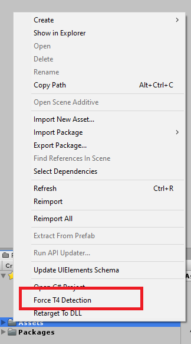

# Unity T4 Template Post Processor

Unity Editor post processor who will related the T4 template to its generated (C#) file.

[Editor call-back](https://forum.unity.com/threads/editor-call-back-after-generate-visual-studio-files.508061)

## Remarks

Need to put this file in an editor subfolder to make sure Unity will pick it up.

Can also be triggered manually through the Assets context menu.

## Solution
- For editor assembly support: replace the string "Assembly-CSharp.csproj" with "Assembly-CSharp*.csproj".
- For runtime text templates: modify the content of the string from TextTemplatingFileGenerator to TextTemplatingFilePreprocessor.

## Authors

* Niek Jannink - [njannink](https://github.com/njannink)

## License

This project is licensed under the MIT License - see the [LICENSE](LICENSE) file for details
